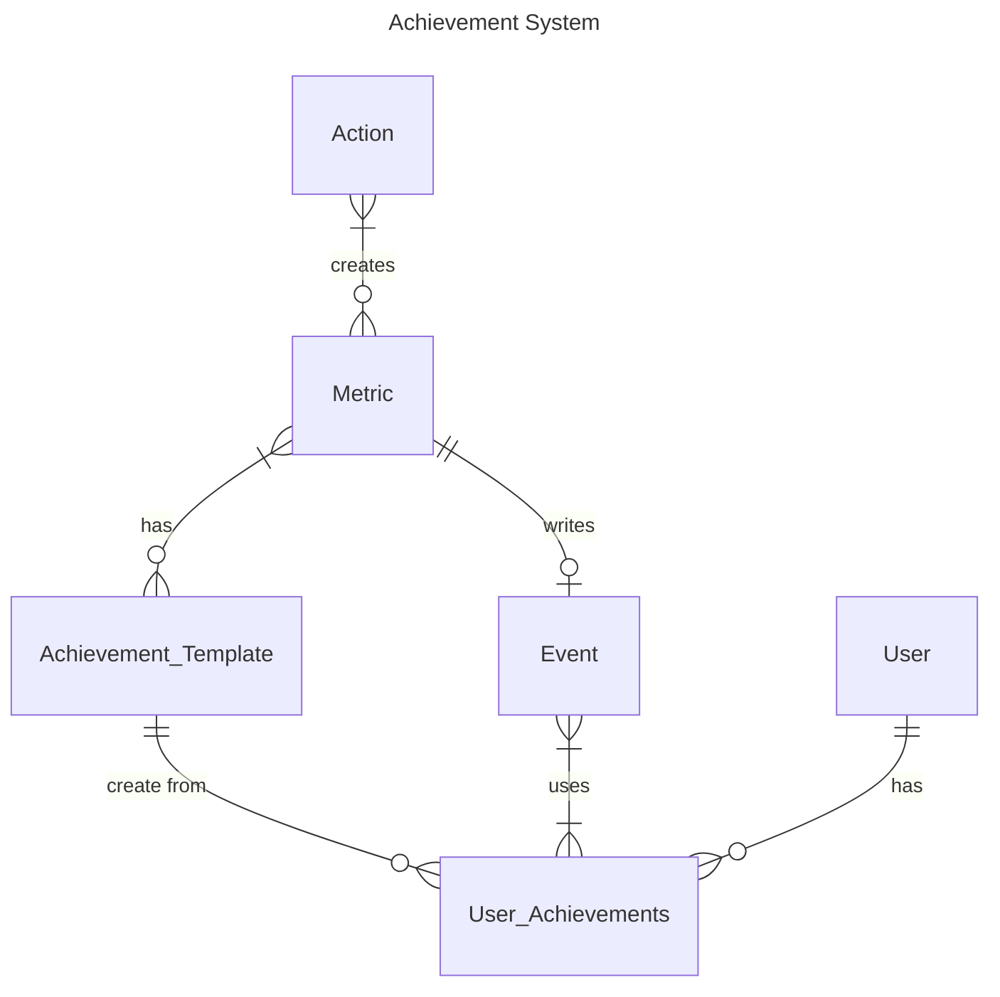
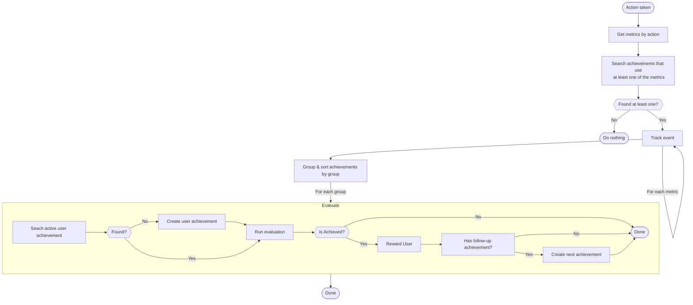

# Gamification / Achievements

> By integrating game-like elements and reward systems, gamification motivates users to actively participate in the learning process and maintain their engagement. By turning learning objectives into challenging tasks and offering rewards for milestones achieved, we incentivize and increase users' intrinsic motivation. This playful approach to learning creates a positive learning environment and increases the effectiveness and fun factor of the educational process in our app.

The achievement system is the heart of our gamification efforts.
It's responsible for tracking user-behaviour as well as evaluating if a user should be rewarded for this.

In the following sections we'll go into details about how the system works and what technical traits we had to take.

## How does it work?

The following ER-Diagram shows how the different elements work together.
Each will be described in detail afterwards.



[Here](https://mermaid.js.org/syntax/entityRelationshipDiagram.html#relationship-syntax) you can find more information about the relation syntax.

-   **Action** \
     The action triggered by the user.
    These will be called from various sources throughout the code.
    The idea is that the different systems can react to these actions an execute notifications / reward the user / etc.
    You can find all possible actions in [common/notification/actions.ts](common/notification/actions.ts).
-   **Metric** \
     A metric is an abstraction over actions that is responsible to extract information from an action.
    The idea is that we can map an action to a value, that can be used for evaluation later on.
    Examples might be basic tracking, where one action call will relate to a metric of value 1.
    Another example could be tracking the time a user spent in zoom meetings. Therefore, we would have a single action, but the metric value would equal to the time spent in the meeting.
    You can find all possible metrics in [common/achievement/metric.ts](common/achievement/metric.ts).
-   **Event** \
     An event is a record of a single user action.
    It contains information about the metric, the user, the relation to a specific entity (like a course or a match) and the calculated value.
    Events are going to be used for evaluation later on.
-   **Achievement Template** \
     Sometimes, there are achievements that should be generated based on matches / course, like "create new course", so they will appear multiple times per user.
    To support this behaviour, we've introduced the abstraction of achievement templates.
    The templates contain all metadata like titles, description, etc. as well as all the information that is required for evaluation.
-   **User Achievement** \
     The specific achievement that is assigned to a user.
    It's always based on a single achievement template and extends it with a context, relation and record value.
    These are required to evaluate and display the achievement.

### Achievement types

There are 3 different achievement types that can be issued as rewards to a user. The system differs between **Streak, Tiered and Sequential Achievements**.

#### Streak Achievements

Streak achievements are an integral part of our rewards system, designed to motivate users to maintain consistent engagement with our platform.
In our rewards system, a streak represents a consecutive series of desired actions performed by a user within a defined timeframe.
These actions could include logging into the platform, completing tasks, or achieving specific milestones.

Streaks serve as a means to encourage users to sustain their engagement over time.
The system tracks users' actions and counts streaks based on the consecutive days or instances in which the desired action is performed.

For example, if a user logs into the platform daily for five consecutive days, they would have a streak of five days.

#### Tiered Achievements

In our rewards system, tiered achievements consist of predefined milestones that users can reach by performing specific actions.
These actions could include participating in meetings, completing tasks, or reaching certain levels of engagement on our platform.

Tiered achievements are structured in a hierarchical manner, with each tier representing a higher level of accomplishment. For example:

-   Tier 1: 1 meeting joined
-   Tier 2: 3 meetings joined
-   Tier 3: 5 meetings joined
-   Tier 4: 10 meetings joined
-   ...

As users perform the specified actions and reach each milestone, they unlock the corresponding tiered achievement.

#### Sequential Achievements

Sequential achievements are a unique type of reward in our system, issued to users who successfully complete a series of predefined actions in a sequential manner.
These actions are typically milestones in a user journey, such as registering on our platform:

1. Register on the platform
2. Verify email address
3. Absolve screening process
4. Hand in certificate of conduct

Upon completing all the actions in the specified order, the user is rewarded with the sequential achievement.

#### One-Time

As of now, there is no "one-time" achievement, as we didn't need it.
If there is a specific use-case in the future, it should be added to the system.

However, if you want to have a similar behaviour, you can use a `tiered` achievement with a `valueToAchieve=0`.

### Groups

Tiered and especially sequential achievements rely on the fact that they are done in order.
Therefore, we've introduced the notion of groups in combination with a group order, that every achievement template has to define.

If an user achievement was achieved, we'll use the group to evaluate which template should be used to generate the next user achievement in order.
Therefore, these groups should be **unique**, as should every group order within a group.

### Achievement relation / context

Sometimes, there are achievements that should be generated based on matches / courses, like "create new course".
To support this behaviour, we've introduced the abstraction of achievement templates.

In order to identify for which course / match an user achievement was created later on, we've added a `relation` field.
This relation is used during evaluation to find all related metrics/events.

TODO: Add more information about how the relation field is structured

Besides that, we are also interested in showing dynamic information in the user-app, like the match partner's name or the course name.
Therefore, we've added another field called `context` to the user achievement, that stores unstructured information similar to the notification system.

TODO: add more information about how to use the context field in our text

### How it works

The following flow chart is giving a rough overview of how the achievement system is working.
Everything shown below is done in [common/achievement/index.ts](common/achievement/index.ts)



## How to create a new achievement

TODO:

## Technical details

### Evaluation

TODO:

### Achievement context vs Action context

The context is responsible for storing information that will be used for templating of the text fields of an achievement.
To have all required information available during the creation of an achievement we've added them to the action taken event:

```ts
export type ActionEvent<ID extends ActionID> = {
    actionId: ActionID;
    at: Date;
    user: User;
    context: SpecificNotificationContext<ID>;
};
```

This means that we'll always store the context of the triggering event into a new achievement, which is not a problem in itself.
Based on this behaviour, one could assume that it's easy to guess which data is available in an achievements context, by looking at the triggering events and their specific context in [common/notification/actions.ts](common/notification/actions.ts).

Unfortunately, this assumption is wrong and might be misleading.
If you have a look at the "How it works" flow chart above, you'll notice that if an achievement was achieved, we'll automatically create the next in the row.
This means, that even if `achievement B` is only caring about `event B`, it will be created with the context of `event A`. Furthermore, `achievement C`, will be created with the context of `event B` and so on.

This makes it hard to validate an achievement's context or show available attributes in Retool.

### Achievement relation vs event relation

Achievement Relation and Event Relation have similar concepts but behave differently.

-   **Event Relation** \
     This relation specifies the course, match, or other entity where an event was triggered.
    It creates a strict connection to a specific entity, typically a lecture.
    If an event has no assigned relation, it will be `null` and treated as global.
    This relation is used to group events and assess them later.

-   **Achievement Relation** \
     This relation shows if an achievement was created for a course or match, based on the template's `templateFor` setting.
    It is used during evaluation to fetch all related metrics and events.
    While it may seem similar to Event Relation, it serves a different purpose.
    A more suitable name might have been **"Achievement Scope,"** but renaming it at this point would be challenging.

Types of `templateFor` Settings and Their Scopes:

-   **Global** \
     The user-achievement relation is always `null` which will include all events related to the specified metrics.
-   **Global_Matches** \
     The relation is simply `match`, meaning it includes all events related to all matches but excludes courses and other entities.
-   **Global_Courses** \
     Similar to `Global_Matches`, but for courses instead of matches.
-   **Match** \
     The relation is `match/<match_id>`, meaning only events from a specific match are considered.
-   **Course** \
     Works the same way as `Match`, but for a specific course: `course/<course_id>`.

### Achievement images

In general, achievement images are uploaded to digital ocean spaces into the following path `gamification/achievements/<achievement_id>`.
You can see all available images by running the following command:

```sh
 aws --profile lf s3 --endpoint https://fra1.digitaloceanspaces.com ls s3://backend-files/gamification/achievements/ --recursive
```

Note that you'll have to configure your aws cli accordingly before.

For the first release, where we haven't had the retool interface yet, we've uploaded the images to `gamification/achievements/release/`, so that we haven't had to care about the ID yet.
This was done via:

```sh
aws --profile lf s3 --endpoint https://fra1.digitaloceanspaces.com cp ./ s3://backend-files/gamification/achievements/release/ --recursive --acl public-read
```

Note: it's important to configure the ACL to public-read. Otherwise, our users won't be able to see the images.

#### Special case: course achievements

Course related achievements (relation course/<course_id>) are a special case here.
Instead of using the provided image, they'll always use the course image.
This will help the user to distinguish many course achievements over time and provides a nice visual representation of the achievement progress page.

## Design decisions

In the following sections, you can find some of the intentional, but yet important design decision that we took in the beginning.

### Buckets vs. negative events

In an event-based environment, you move from one state to another based on events.
This works perfectly fine in the happy path, where you expect a user to trigger one event after another.

However, there are limitations if you need to react to missed events, such as when a user doesn't attend a lecture.
During our initial design discussions, we considered two possible solutions:

1. **Negative events** \
   We thought about introducing negative events that would be triggered when a specific event was missing.
   For example, whenever a lecture starts, we would trigger a job that iterates over all users and checks whether they attended.
   If not, a negative event would be triggered.
2. **Buckets** \
   Instead of relying solely on a sequence of events, buckets allow us to compare expectations with reality.
   For example, we could create a bucket for each lecture, assign all related events to that bucket, and then check whether every bucket contains at least one event.

We decided to go with the bucket approach, as it's more flexible and allows us to handle more complex scenarios.

### Event tracking

TODO:

## Limitations

### Dynamic result evaluation

In many cases you might be interested to compare the event aggregation to another value gathered from the DB.
A prominent example would be the "Kurs Beenden" achievement, which says that you've attended all lectures of a course.

In theory, you would count the number of attended lectures of a user and compare it to the total number of lectures.
Unfortunately, this is not possible in our current setup, as the algorithm is only able to aggregate metrics and compare these results at the moment.

In order to achieve something similar, we would have to provide a way to provide more infomration to the evaluation function.

### Synced achievement context

TODO:

### Achievement context validation

TODO:
