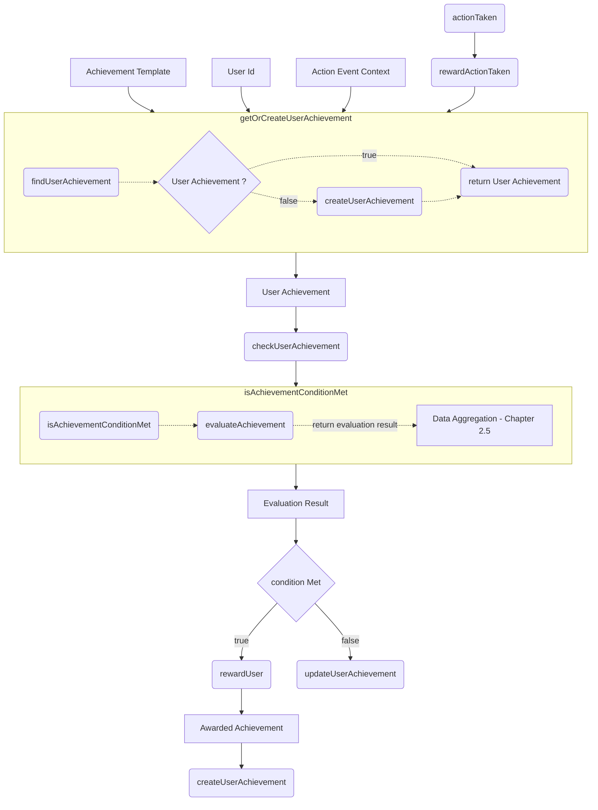
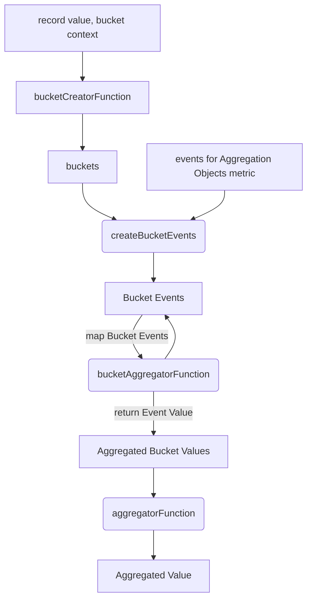

# Achievement

Achievements are a part of the Gamification. They are stored in the database as user_achievement and should not be mistaken with the achievement_template database table. The distinct differences are explained in Chapter [1.1 Database Models](#database-models)

### Table of Contents

1.  [Features](#features)
    1.1. [Database Models](#database-models)
    1.2. [Components](#components)
    1.3. [Resolvers](#resolvers)
2.  [Achievement System](#achievement-system)
    2.1. [Reward Action](#reward-action)
    2.2. [Get or Create User Achievement](#get-or-create-user-achievement)
    2.3. [Create Achievement](#create-achievement)
    2.4. [Check User Achievement](#check-user-achievement)
    2.5. [Evaluate Achievement](#evaluate-achievement) & [Aggregation Functions](#aggregation-functions)

## 1. Features

-   Create Achievement Templates: Administrators can create new achievement templates inside the database
-   Create Achievements: New achievements get created when related events are triggered by a users action or when previous achievements of the same group are marked as achieved
-   Evaluate Achievements: Achievements are evaluated for fulfillment of the conditions to either issue the reward or update a started achievement.

### 1.1. Database Models

| achievement_template                                                                  | user_achievement                                                                                                      |
| :------------------------------------------------------------------------------------ | :-------------------------------------------------------------------------------------------------------------------- |
| predefined blueprint in the database that is used to create new achievements from it. | achievement data related to a user that stores information about the achievement, its status and when it was achieved |

#### achievement_template

| field                                                               | description                                                                                                                                                             |
| :------------------------------------------------------------------ | :---------------------------------------------------------------------------------------------------------------------------------------------------------------------- |
| `id`                                                                | unique id                                                                                                                                                               |
| `name`                                                              | displayed name of the template                                                                                                                                          |
| `metrics`                                                           | used to identify all events related to a achievement template                                                                                                           |
| `templateFor`                                                       | discriminator to clarify a relation of an achievement template to 1. one match, 2. all matches, 3. one subcourse, 4. all subcourses or no relation                      |
| `group`                                                             | Affiliation of templates with the same group                                                                                                                            |
| `groupOrder`                                                        | indexes to keep the templates inside group arrays in order                                                                                                              |
| `stempName`                                                         | exclusively used for sequential achievements to be displayed as a step of this template group                                                                           |
| `type`                                                              | achievement types `SEQUENTIAL`, `TIERED` and `STREAK`                                                                                                                   |
| `subtitle`                                                          | subtitle of an achievement                                                                                                                                              |
| `description`                                                       | description text of an achievement                                                                                                                                      |
| `image`                                                             | image of a achievement / an achievement step                                                                                                                            |
| `achievedImage`                                                     | exclusively used for streak achievements that are currently achieved                                                                                                    |
| `actionName`                                                        | optional button label                                                                                                                                                   |
| `actionRedirectLink`                                                | optional redirect reference for buttons                                                                                                                                 |
| `actionType`                                                        | type to define what icon is displayed for an achievement action                                                                                                         |
| `actionName`                                                        | label text for an achievement action                                                                                                                                    |
| `condition`                                                         | condition to be met for a reward to be issued for an achievement                                                                                                        |
| 
`conditionDataAggregation`
 | context information on what buckets to create for the achievements metrics and how to aggregate action events for these conditions to check if they have been fulfilled |
| `user_achievement`                                                  | all user_achievements that share a relation with this achievement_template                                                                                              |

#### user_achievement

| field         | description                                                                    |
| :------------ | :----------------------------------------------------------------------------- |
| `id`          | unique id                                                                      |
| `templateId`  | id of the related achievement_template                                         |
| `template`    | related achievement_template found by the templateId                           |
| `userId`      | id of the related user                                                         |
| `group`       | copy of the related templates group field                                      |
| `groupOrder`  | copy of the related templates groupOrder field                                 |
| `isSeen`      | set true when a user has viewed an achieved achievement on their progress page |
| `achievedAt`  | timestamp set, if a achievements condition was met                             |
| `recordValue` | record value on how long the longest streak was held up                        |
| `context`     | relations to matches, subcourses, pupils and students by their id              |

### 1.2. Components

| Components      | function                                                                                                                                                                                                                             |
| --------------- | :----------------------------------------------------------------------------------------------------------------------------------------------------------------------------------------------------------------------------------- |
| `aggregator.ts` | Aggregators are functions used to process values, passed inside events triggered by user action. They can sum, count, check for existance of events or check the number of events for an achievement                                 |
| `bucket.ts`     | Buckets are functions to pre-sort and / or aggregate events by their type or timestamp                                                                                                                                               |
| `create.ts`     | functions to find certain achievements, get achievements, create achievements based on previously missing ones or to create an achievement as a follow-up achievement to a previous one                                              |
| `evaluate.ts`   | functions to evaluate if an achievements conditions are met based on the [conditionDataAggregation](#conditionDataAggregation) of the related achievement_template                                                                   |
| `get.ts`        | resolver functions to get all achievements, get certain achievements to be displayed as next steps, get achievements that are yet to be initialized, get achievements by their id and assemble the achievement data for the frontend |
| `index.ts`      | functions to initialize the evaluation process when an action was taken, cache metrics for events, and reward users when achievement conditions are met                                                                              |
| `metric.ts`     | functions to create metrics together with their related actions when building the project                                                                                                                                            |
| `metrics.ts`    | functions to register one or more metrics and to get metrics based on an action id                                                                                                                                                   |
| `template.ts`   | functions to get all templates presorted by group or metrics and to get templates with a certain metric                                                                                                                              |
| `types.ts`      | additional types used for the process of evaluation and creation of achievements                                                                                                                                                     |
| `util.ts`       | additional functions for achievement processing                                                                                                                                                                                      |

### 1.3. Resolvers

All resolvers can be found in `common/achivement/get.ts`

1.  `getAchievementById`: function to get an achievement of a user based on an achievement id
2.  `getNextStepAchievements`: function to get a users achievements that will be displayed as a next step card on their dashboard
3.  `getFurtherAchievements`: function to get the achievement templates, which do not yet have an associated user achievement for the corresponding user but belong to an already initialized achievement group, as inactive achievements.
4.  `getUserAchievements`: function to get all user achievements found for a user

## 2. Achievement System

The achievement system is set up as follows

[Go to Data Aggregation - Chapter 2.5](#data-aggregation)

### 2.1. Reward Action

The achievement is linked to the pre-existing notification system and therefore triggers the `rewardActionTaken` function when ever the `actionTaken` function for a future notification is executed. This is working since achievements that have newly matched their conditions are announced as a notification, therefore naturally being linked to an action taken call.

Based on the metrics for the action that triggered the `rewardActionTaken` function the templates for this action are fetched and sorted by their group. For every one of these groups the [`getOrCreateUserAchievement`](#get-or-create-user-achievement) function is called to receive the user_achievement from the database that has to be evaluated inside the [`checkUserAchievement`](#check-user-achievement) function, which is subsequently executed using the already received user_achievement.

### 2.2. Get or Create User Achievement

The `getOrCreateUserAchievement` function is trying to find a pre-existing user achievement that matches the values passed, in order to return this achievement to our [`rewardActionTaken`](#reward-action) function. If no user achievement was found the [`createAchievement`](#create-achievement) function is triggered to return the newly create user_achievement instead.

### 2.3. Create Achievement

Inside the `createAchievement` function all of the users pre-existing achievements for the template, passed down from the [`rewardActionTaken`](#reward-action) function, are taken to determine the groupOrder of the following achievement that has to be created. The `groupOrder` value then is used to create a new user_achievement in the database for the achievement_template inside the achievement template group array, that has the matching value in its `groupOrder` field. The creation process is not finished, if the groupOrder of the subsequent achievement was outside the given range of group elements, meaning the group was already finished and in no need to be continued.

### 2.4. Check User Achievement

The `checkUserAchievement` function checks whether the conditions for rewarding the user are met. If this is the case, the evaluations result object, returned from the [`isAchievementContidionMet`](#isachievementconditionmet) function is used to reward the user ([`rewardUser`](#rewarduser)) and to create the subsequent user_achievement

#### isAchievementConditionMet

This function is taking all necessary values from the passed achievement and event to trigger [`evaluateAchievement`](#evaluate-achievement). The result contains a conditionIsMet boolean and the `resultObject` and is returned to the [`checkUserAchievement`](#check-user-achievement) function.

#### rewardUser

The `rewardUser` function is updating the achievement that triggered it by setting a timestamp in the `achievedAt` field, updating the optional `recordValue` field if one was given and setting the `isSeen` field to false so a user can identify their new achievement. The updated achievement is then used to trigger the creation of a notification that is displayed to the user.

### 2.5. Evaluate Achievement

In order to evaluate an achievement all related events are sorted by their metric and a potential `recordValue` is taken from the `resultObject`. Thereupon the aggregations are executed for every condition object found in the user_templates [`conditionDataAggregation`](#conditionDataAggregation).

#### Aggregation Functions

1.  `bucketCreatorFunction`: function used to determine whether events are put into a default bucket or split by lecture start, by weeks or by months
2.  `createBucketEvents`: function filling all previously created buckets with events that suit the buckets conditions
3.  `bucketAggregatorFunction`: function processing all event values inside a numbers array passed down to it, returning a single number
4.  `aggregatorFunction`: function receiving an array of numbers, created by previously calling the _`bucketAggregatorFunction`_ for every bucket created by the _`bucketCreatorFunction`_

#### Data Aggregation

To aggregate the evaluation data a sequence of functions is triggered to sort the events into different buckets and then receive a value from the aggregator function

1.  The required **`bucketCreatorFunction`**, **`bucketAggregatorFunction`** and **`aggregatorFunction`** are selected using a value of the dataAggregationObject / a default creator function is selected
2.  The **`bucketCreatorFunction`** is called to create buckets from an optional record value and the bucket context
3.  The events are transferred to the buckets for which they fulfill the conditions inside **`createBucketEvents`**
4.  For every bucket, filled with events, the events values are aggregated to single values and put together in an array of numbers by executing the **`bucketAggregatorFunction`**
5.  The Aggregated Bucket Values are processed to one Aggregated Value inside the **`aggregatorFunction`**

#### Evaluation of aggregated Values

Swan is a utility in this project that facilitates the evaluation of the **Aggregated Values** inside a Result Object by utilizing the condition value provided to the swan.parse function. The resulting value is a boolean indicating whether the achievements condition is met or not. Together with the **Result Object**, containing all **Aggregated Values**, this **Evaluation Result** is returned to [`isAchievementConditionMet`](#isachievementconditionmet).
